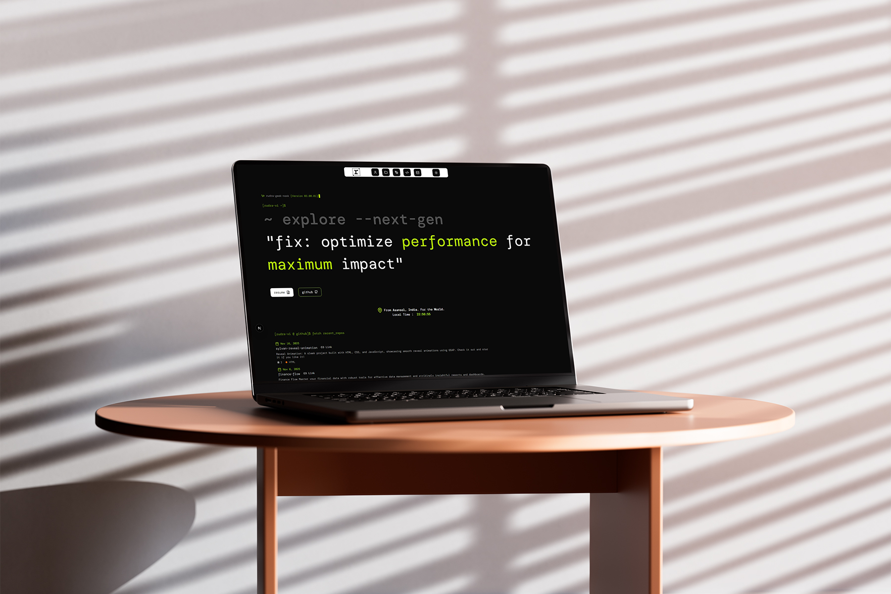

# Rudra Geek Nook

A modern and dynamic personal portfolio/blog website crafted with Next.js, featuring a clean, responsive design and a unique, interactive terminal-like experience. This platform serves as a comprehensive showcase of my projects, skills, and insights, detailing my journey and work as a developer.


**Live Demo:** [rudra-geek-nook](https://rudra-geek-nook.vercel.app/)

## 💕 About

**Rudra Geek Nook** is a high-contrast, editorial-style personal portfolio and creative manifesto built with Next.js. This project explores my journey and work as a developer through a dynamic, magazine-inspired design. It features several thematic sections that guide the user through my digital presence:

- **About**: My story, philosophy, and professional background.
- **Projects**: A showcase of my key development projects.
- **Redesigns**: Demonstrations of UI/UX improvements and redesign concepts.
- **Skills**: An overview of my technical proficiencies.
- **Contact**: Information for reaching out and connecting.

## ✨ Features

This project is built with a modern tech stack and includes several notable features:

- **Interactive Navigation:** An engaging navigation system providing quick access to distinct sections like About, Projects, Redesigns, Skills, and Contact.
- **Terminal-like Content:** Unique accordion components that simulate command-line interactions, revealing personal philosophies, career journey, and fun facts in an innovative way.
- **Theming:** Seamless dark mode toggle for an enhanced and comfortable user experience.
- **Responsive Design:** Meticulously optimized for various screen sizes, ensuring a consistent and fluid experience across all devices.
- **Performance Focused:** Leverages Next.js capabilities for server-side rendering (SSR) and static site generation (SSG), ensuring rapid load times and optimal performance.
- **Video Integration:** Seamless support for embedding and playing video content using `next-video`.
- **Modern UI Components:** Built using Radix UI for accessible, customizable, and high-quality user interface components.

## Technologies Used

This project leverages a modern and robust set of technologies and libraries:

- **Framework:** [Next.js](https://nextjs.org/) 16 (App Router)
- **Language:** [TypeScript](https://www.typescriptlang.org/)
- **Styling:** [Tailwind CSS v4](https://tailwindcss.com/blog/tailwindcss-v4-alpha) for utility-first styling, complemented by `clsx` and `tailwind-merge`.
- **UI Components:** Utilizes [Shadcn/ui](https://ui.shadcn.com/) for beautifully designed and accessible components, built on top of [Radix UI](https://www.radix-ui.com/) primitives (e.g., Accordion, Dialog, Label, Slot).
-   - [Sonner](https://sonner.emilkowalski.no/) is specifically integrated for elegant toast notifications.
- **Icons:** [Lucide React](https://lucide.dev/) for a collection of beautiful and customizable SVG icons.
- **Theming:** [next-themes](https://github.com/pacocoursey/next-themes) for seamless dark mode implementation.
- **Animations:** [Motion](https://www.framer.com/motion/) (Framer Motion) for powerful and declarative animations.
- **Video Handling:** [next-video](https://www.next-video.dev/) for optimized video integration.
- **Code Quality:** [Biome](https://biomejs.dev/) for fast and comprehensive linting and formatting.
- **Dependency Management:** npm

## 🚀 Getting Started

First, install the dependencies:

**Prerequisites:** Node.js 22 LTS or later is recommended.

```bash
npm install
```

Then, run the development server:

```bash
npm run dev
```

Open [http://localhost:3000](http://localhost:3000) in your browser to see the website.

The page will automatically reload when you make changes to the code. You can also view any build errors or lint warnings in the console.

### Available Scripts

- `npm run dev` - Starts the development server.
- `npm run build` - Creates an optimized production build.
- `npm run start` - Starts the production server (after building).
- `npm run lint` - Runs Biome to check for code issues.
- `npm run format` - Formats code with Biome.

## 🎨 Customization

### Modifying Colors and Styling

The project uses Tailwind CSS v4 with custom utilities. To change the color scheme or styling:

1.  Edit `src/app/globals.css` to update CSS variables and custom utilities.
2.  Modify Tailwind classes in component files.
3.  The color palette and design tokens are defined in the global CSS file.

### Adding New Sections or Content

To add new sections or dynamic content:

1.  Create new components in `src/components`.
2.  Update `src/contents/index.tsx` for navigation items or accordion content.
3.  Modify `src/app/(pages)` or `src/app/page.tsx` for new routes or layout adjustments.

## 📂 Project Structure

A brief overview of the project's directory structure:

```plaintext
📁 rudra-geek-nook/
├── 📁 .next/                 # Next.js build output
├── 📁 node_modules/          # Project dependencies
├── 📁 public/                # Static assets (images, fonts, etc.)
│   └── 📁 assets/            # Project-specific assets (logo, resume, etc.)
├── 📁 src/
│   ├── 📁 app/               # Next.js App Router root (routes, layouts, API)
│   │   ├── 📁 (pages)/       # Grouped dynamic pages (about, contact, projects, etc.)
│   │   ├── 📁 api/           # API routes
│   │   └── ... (root layout, global styles, etc.)
│   ├── 📁 components/        # Reusable UI components (grouped by section or type)
│   │   ├── 📁 @about/        # About page specific components
│   │   ├── 📁 @contact/      # Contact page specific components
│   │   ├── 📁 @home/         # Home page specific components
│   │   ├── 📁 @projects/     # Projects page specific components
│   │   ├── 📁 @redesigns/    # Redesigns page specific components
│   │   ├── 📁 @skills/       # Skills page specific components
│   │   ├── 📁 @theme/        # Theme related components
│   │   └── 📁 ui/            # Shadcn UI and custom UI components
│   ├── 📁 contents/          # Static content data (navigation items, accordion content)
│   ├── 📁 context/           # React Context API for global state
│   ├── 📁 lib/               # Utility functions and helper modules
│   └── 📁 videos/            # Dedicated directory for video assets
├── .gitignore               # Git ignore rules
├── README.md                # Project README
├── biome.json               # Biome configuration
├── components.json          # Shadcn UI components configuration
├── next.config.ts           # Next.js configuration
├── package.json             # Project metadata and scripts
├── tsconfig.json            # TypeScript configuration
└── ... (other configuration files)
```

## 🦾 Building for Production

To create a production build and start the production server:

```bash
npm run build
npm run start
```

## 😵‍💫 Troubleshooting

### Common Issues

1.  **Port already in use:**

    ```bash
    npm run dev -- -p 3001
    ```

2.  **Dependency issues:**

    ```bash
    rm -rf node_modules package-lock.json
    npm install
    ```

3.  **Linting or Formatting Errors:** Run `npm run lint` or `npm run format` to fix issues automatically.

4.  **Build failures:** Check console error messages; ensure all dependencies are installed and compatible versions are used.

## 🧑‍💻 Code Quality

This project uses Biome for linting and formatting to ensure a clean and consistent codebase.

- Run `npm run lint` to check code style.
- Run `npm run format` to automatically format your code with Biome.

## 🗺️ Roadmap

This portfolio is continuously evolving with exciting new features planned:

- **Enhanced Performance:** Continued optimization for faster load times and smoother interactions across all devices.
- **Dynamic Content Integration:** Implementing features to easily add and manage new projects, and redesign case studies.
- **Advanced Search & Filtering:** Developing robust search and filtering capabilities for projects and content.
- **Accessibility Improvements:** Further enhancements to ensure the site is fully accessible to all users.

_Your feedback and suggestions are welcome as I continue to build and refine this platform!_

## 🤝 Contributing

Open to suggestions and feedback! To contribute:

- Fork the repository.
- Create a new branch (`git checkout -b feature/YourFeatureName`).
- Commit your changes (`git commit -m 'Add some feature'`).
- Push to the branch (`git push origin feature/YourFeatureName`).
- Open a pull request.

## 🧑‍🦱 Author

[](https://github.com/rudra-xi)

## 📱Contact

[](https://www.instagram.com/rudra.xii/)
[](https://www.linkedin.com/in/goutam-rudraxi)

## 🪪 License

This project is licensed under the MIT License. See the [](/LICENSE.md) file for more information.
